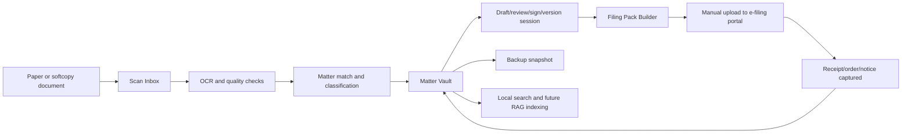

# Windows Legal Document Vault Document Flow and Operations

This file describes how documents move through the Windows plug-and-play DMS from intake to filing, receipt capture, backup, and future retrieval.

## End-to-End Document Lifecycle



## Operational Flow 1: New Matter Setup

### Trigger

The firm receives new instructions or decides to digitize an existing physical file.

### Steps

1. User clicks "New Matter."
2. User enters matter name and optional internal matter number.
3. User selects practice area.
4. User adds parties and client.
5. User adds court details if known.
6. User chooses whether to import an existing folder or start empty.
7. System creates matter record and local vault folder/record.
8. System creates initial audit event.

### Output

- Matter created.
- Default matter folder structure available.
- Matter appears in search and recent matters.

## Operational Flow 2: Scan Physical Documents

### Trigger

An advocate or clerk has physical pleadings, affidavits, annexures, receipts, orders, or evidence to digitize.

### Steps

1. User scans documents using existing scanner software into the watched scan folder.
2. Tray app detects new files.
3. System imports files into Scan Inbox.
4. System checks whether files are readable, corrupted, encrypted, or duplicated.
5. System performs OCR.
6. System suggests document type and matter.
7. User confirms or corrects matter and type.
8. System stores the document in the matter vault.
9. System records audit event.

### Output

- Searchable document in matter.
- OCR text available.
- Original scan preserved.
- Document type assigned.

## Operational Flow 3: Import Existing Softcopy Folder

### Trigger

A firm already has matter documents in Windows folders, OneDrive folders, external drives, or old archive folders.

### Steps

1. User selects "Import Existing Folder."
2. User chooses source folder.
3. System scans folder recursively.
4. System identifies files and likely document types.
5. System detects duplicates by hash and filename similarity.
6. User reviews import summary.
7. System copies or moves files into the vault based on user choice.
8. System runs OCR for image PDFs and images.
9. System creates import report.

### Output

- Existing matter folder is represented in the DMS.
- Import report lists imported, skipped, duplicate, failed, and unsupported files.

## Operational Flow 4: Draft to Filed Version

### Trigger

An advocate drafts a pleading or edits an imported document.

### Steps

1. User imports or creates draft.
2. User marks status as "Draft."
3. User exports for editing in Word or links external editor workflow.
4. User imports revised draft.
5. System creates a new version.
6. User marks version as "Reviewed" or "Approved."
7. User imports signed/scanned copy.
8. System links signed copy to draft lineage.
9. User adds signed copy to filing pack.
10. After manual filing, user marks it as "Filed" and attaches filing receipt.

### Output

- Draft and signed/filed versions remain distinct.
- Filed copy is locked from overwrite.
- Receipt is linked to filed copy.

## Operational Flow 5: Filing Pack Preparation

### Trigger

The advocate is ready to file a new case or additional document on the Judiciary e-filing portal.

### Steps

1. User opens matter.
2. User clicks "Create Filing Pack."
3. User selects filing type:
   - New case.
   - Existing case additional filing.
   - Response.
   - Application.
   - Submissions.
   - Other.
4. User selects documents.
5. System creates a snapshot of selected versions.
6. System runs readiness checks.
7. System generates warnings and required fixes.
8. User resolves warnings or accepts non-blocking warnings.
9. System exports pack folder or zip.
10. System generates index and manual upload checklist.

### Filing-Pack Readiness Checks

Checks should include:

- PDF format.
- File size.
- Separate file per document.
- Encryption/password protection.
- Virus scan status.
- Page count.
- OCR confidence.
- Blank pages.
- 300 DPI where detectable.
- Missing signature risk.
- Duplicate document risk.
- Filename and caption readiness.

### Output

```text
Filing-Pack-[Matter]-[Date]/
  00-filing-pack-summary.pdf
  01-document-index.pdf
  02-upload-checklist.md
  documents/
    001-plaint.pdf
    002-verifying-affidavit.pdf
    003-annexure-a.pdf
  reports/
    readiness-report.json
    size-report.csv
```

## Operational Flow 6: Manual E-Filing Upload

### Trigger

Filing pack has been prepared and the advocate/clerk is ready to upload to `efiling.court.go.ke`.

### Steps

1. User opens official e-filing portal manually.
2. User logs in with official credentials.
3. User files new case or chooses existing case.
4. User uploads PDFs from the filing-pack folder.
5. User pays assessed fees through portal-supported channels.
6. User downloads or saves receipt, notice, and any confirmation.
7. User returns to DMS.
8. User attaches receipt and confirmation to filing pack.
9. System marks filing pack as filed.

### Output

- Filing pack status: Filed.
- Receipt attached.
- Court-generated documents saved.
- Audit event created.

## Operational Flow 7: Capture Court Outputs

### Trigger

Court issues an order, ruling, judgment, notice, receipt, or cause-list entry.

### Steps

1. User downloads file, screenshots page, or imports email attachment.
2. System detects likely court output.
3. User links output to matter.
4. User selects court output type.
5. System OCRs and stores.
6. System updates matter timeline.

### Output

- Court output appears in matter timeline and court outputs tab.
- Search index includes the output.
- Future RAG connector can cite it.

## Operational Flow 8: Backup and Restore

### Backup Steps

1. Backup schedule triggers.
2. System checks vault integrity.
3. System creates encrypted snapshot.
4. System writes snapshot to selected backup target.
5. System verifies snapshot checksum.
6. System records backup event.

### Restore Drill Steps

1. User opens Backup Center.
2. User chooses "Test Restore."
3. System restores a sample matter or metadata into a temporary restore location.
4. System verifies document count, checksums, and database consistency.
5. System records restore test result.

### Output

- Backup health visible.
- Restore confidence proven.

## Offline Behavior

When internet is unavailable:

- App opens normally.
- Vault is accessible.
- OCR works if local OCR engine is available.
- Search works against local index.
- Filing packs can be prepared.
- Backup to local/external drive can proceed.
- Cloud backup is queued.
- E-filing upload is deferred.

## Matter Timeline

Every matter should have a timeline of:

- Documents imported.
- Drafts revised.
- Filing packs generated.
- Portal filing completed.
- Receipts attached.
- Orders/rulings received.
- Cause-list entries added.
- Backup events.
- User notes.

This timeline makes the file understandable even months later.

## Practical Daily Workflow

A typical small-firm day:

1. Clerk scans overnight documents.
2. DMS imports them into Scan Inbox.
3. Clerk assigns matters and document types.
4. Advocate reviews pending drafts.
5. Filing pack is generated for today's court filing.
6. Clerk manually uploads to e-filing.
7. Clerk attaches receipts and notices.
8. DMS backs up the vault at day's end.

## Operating Principle

The DMS should reduce the mental load of "where is that document?" and "which version did we file?"

It should not require the firm to change how the Judiciary portal works.
