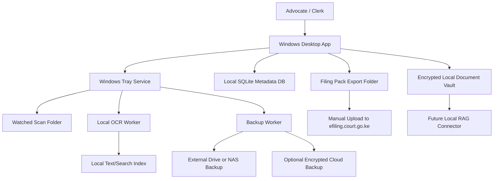
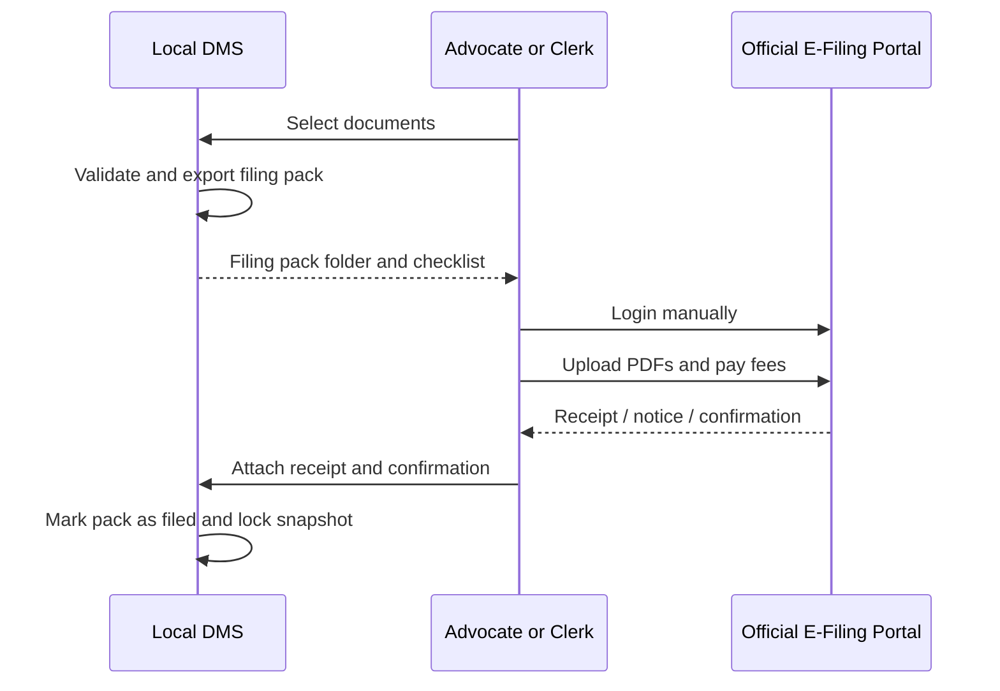

# Windows Legal Document Vault Architecture

## Architecture Goal

The architecture must support a Windows plug-and-play product that works locally first, keeps documents under the firm's control, prepares e-filing packs, and later exposes a clean integration point for RAG.

The first build should prefer reliability and simple deployment over architectural sophistication.

## Recommended V1 Architecture

## Main Components

### 1. Windows Desktop App

Responsibilities:

- Matter management.
- Document browsing.
- Search UI.
- Scan inbox review.
- Filing-pack builder UI.
- Backup center UI.
- Settings.
- Audit log display.

Possible implementation options:

- Tauri.
- Electron.
- Native .NET desktop.

Final choice is deferred until code planning. Documentation assumes only that the app can:

- Install on Windows.
- Run a tray/background worker.
- Access local files.
- Use SQLite.
- Run local OCR tooling.
- Export files and reports.

### 2. Windows Tray Service

Responsibilities:

- Watch scan folders.
- Queue OCR jobs.
- Monitor backup schedules.
- Show backup health.
- Show import notifications.
- Continue safe background tasks when UI is closed.

The tray service should not perform risky destructive operations without user confirmation.

### 3. Local Metadata Database

Recommended: SQLite.

Data stored:

- Matters.
- Parties.
- Document metadata.
- Document version metadata.
- OCR status.
- Filing packs.
- Filing events.
- Receipt links.
- Backup snapshots.
- Audit events.
- Search metadata.

The database stores metadata and pointers to encrypted file objects. It should not be the only copy of document content.

### 4. Encrypted Document Vault

The vault stores original and generated documents.

Vault object types:

- Original imported files.
- OCR text sidecars.
- Searchable PDFs.
- Generated filing-pack reports.
- Export manifests.
- Backup manifests.

The vault should support:

- Integrity checks.
- Version object immutability after filed/served status.
- Export to normal folders.
- Restore from backup.

### 5. OCR Worker

Responsibilities:

- Extract text from PDFs where text exists.
- OCR image-only PDFs.
- OCR images.
- Generate searchable PDF where possible.
- Store page-level OCR text.
- Store confidence scores.

Local OCR is preferred. Cloud OCR should not be part of V1 unless explicitly enabled as an optional adapter with strong warnings and consent.

### 6. Search Index

V1 search can be simple:

- SQLite FTS for text search, or
- A lightweight local index.

Search should support:

- Matter name.
- Party name.
- Case number.
- Document type.
- Date.
- Full text.
- Status.

The future RAG connector can build a separate vector index without changing the DMS source of truth.

### 7. Backup Worker

Responsibilities:

- Create encrypted snapshots.
- Write to local/external/NAS/cloud targets.
- Verify snapshot checksum.
- Record backup events.
- Support restore.

Backup should be designed around recovery, not only sync.

### 8. Filing Pack Exporter

Responsibilities:

- Create immutable filing-pack snapshot.
- Run readiness checks.
- Export selected PDFs.
- Generate index and checklist.
- Generate readiness report.
- Track post-filing receipts.

The filing pack is a bridge to the official e-filing portal. The app does not submit directly in V1.

## Conceptual Data Model

### Matter

Fields:

- `id`
- `name`
- `internal_reference`
- `court_case_number`
- `court`
- `court_station`
- `division`
- `practice_area`
- `client_name`
- `responsible_advocate`
- `status`
- `created_at`
- `updated_at`

### Party

Fields:

- `id`
- `matter_id`
- `name`
- `role`
- `contact_details`
- `identifier_notes`

### Document

Fields:

- `id`
- `matter_id`
- `title`
- `document_type`
- `current_version_id`
- `status`
- `created_at`
- `updated_at`

### DocumentVersion

Fields:

- `id`
- `document_id`
- `version_number`
- `status`
- `vault_object_id`
- `source_vault_object_id`
- `file_hash`
- `page_count`
- `ocr_status`
- `created_by`
- `created_at`
- `notes`

### FilingPack

Fields:

- `id`
- `matter_id`
- `filing_type`
- `status`
- `export_path`
- `readiness_status`
- `created_by`
- `created_at`
- `filed_at`

### FilingEvent

Fields:

- `id`
- `filing_pack_id`
- `event_type`
- `portal_reference`
- `receipt_document_id`
- `notes`
- `created_at`

### BackupSnapshot

Fields:

- `id`
- `target_type`
- `target_label`
- `snapshot_hash`
- `status`
- `started_at`
- `completed_at`
- `restore_tested_at`

### AuditEvent

Fields:

- `id`
- `actor`
- `event_type`
- `entity_type`
- `entity_id`
- `timestamp`
- `details`
- `hash_chain_value`

## Storage Modes

### Mode 1: Single PC

Best for solo advocates.

- Vault on local disk.
- Backup to external drive.
- Optional encrypted cloud backup.

### Mode 2: PC Plus External Drive

Best for solo advocates with more documents.

- Vault on PC.
- Scheduled backup to external drive.
- Reminder if drive missing.

### Mode 3: Office Shared Folder or NAS

Best for small firms.

- Vault path on office shared storage.
- App installed on user PCs.
- Basic local user permissions.
- More advanced locking and multi-user conflict handling may be phased.

## Multi-User V1 Approach

For MVP, keep multi-user simple:

- One vault owner.
- Optional named users.
- Audit actor recorded.
- Avoid simultaneous editing of the same document.
- Warn if vault is opened from unsupported network path.

More advanced real-time collaboration can come later.

## E-Filing Boundary

## Integration Boundary for Local Matter RAG Connector

Local Matter RAG Connector reads from:

- DMS metadata API or local database view.
- OCR text.
- Matter metadata.
- Document version references.

Local Matter RAG Connector does not:

- Own original files.
- Modify the vault directly.
- Decide filing status.
- Replace DMS search for ordinary document management.

## Integration Boundary for Wakili-Mkononi Matter AI Integration

Wakili-Mkononi Matter AI Integration connects Wakili to Local Matter RAG Connector.

Wakili should receive:

- Matter-scoped retrieved snippets.
- Source document references.
- Page ranges.
- Document status.
- Confidence score.

Wakili should not receive:

- Whole vault sync by default.
- Documents outside the selected matter.
- Drafts if the user has excluded drafts.
- Unredacted sensitive material unless authorized.

## Reliability Requirements

- App must open without internet.
- Existing documents must remain accessible if OCR worker fails.
- Backup failure must not corrupt vault.
- Filing pack export must be reproducible from selected versions.
- Failed imports must produce a report.
- Restore must be testable.

## Architecture Risks

### Risk: Encryption Key Loss

Mitigation:

- Recovery key export during setup.
- Strong warnings.
- Recovery drill prompts.

### Risk: Network Folder Corruption

Mitigation:

- Lock file.
- Integrity checks.
- Backup before migration.
- Explicit NAS mode.

### Risk: OCR Performance on Low-End PCs

Mitigation:

- Queue OCR.
- Run in background.
- Pause when on battery.
- Allow "index later."

### Risk: Users Treat Filing Pack as Filed

Mitigation:

- Filing pack status remains "Prepared" until receipt is attached or user marks filed.
- UI clearly says manual upload is required.

## Architecture Principle

The DMS owns the matter record. The RAG connector indexes the matter record. Wakili uses the indexed context. The e-filing portal remains the official submission system.
