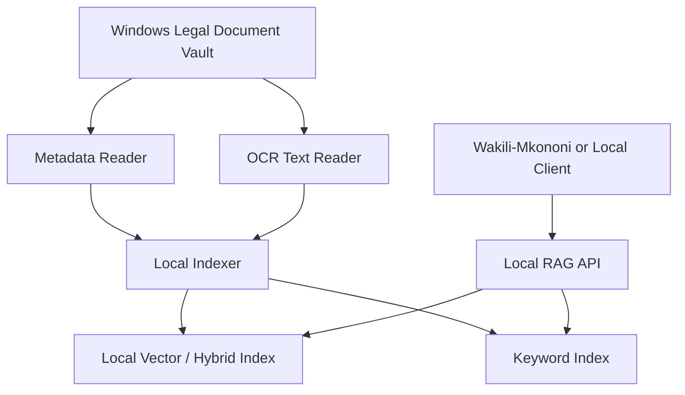

# Local Matter RAG Connector

## Product Definition

Local Matter RAG Connector is a separate local retrieval-augmented generation connector.

It indexes the local document vault from Windows Legal Document Vault or another existing document database. It does not become the system of record and does not own original documents.

The product's promise:

"Ask questions and draft from your matter record without uploading your whole archive to a cloud AI platform."

## Why It Is Separate

Windows Legal Document Vault solves document ownership and operations.

Local Matter RAG Connector solves retrieval and context preparation for AI workflows.

Keeping them separate avoids:

- Turning the DMS into an AI-only product.
- Forcing firms to adopt RAG before they trust the document system.
- Mixing document custody with model orchestration.
- Exposing all documents to Wakili by default.

## Users

- Advocates asking questions about a matter record.
- Clerks finding documents quickly.
- Wakili-Mkononi as a downstream consumer.
- Future drafting agents.

## Core Capabilities

### Local Indexing

The connector indexes:

- OCR text.
- PDF embedded text.
- Document metadata.
- Matter metadata.
- Document status.
- Version status.
- Page ranges.
- Filing status.
- Court-output type.

### Matter-Scoped Retrieval

Default retrieval scope is one matter.

Broader search across matters should require explicit permission.

### Filters

Filters should include:

- Matter.
- Document type.
- Date range.
- Status.
- Filed only.
- Drafts included/excluded.
- Court outputs only.
- Receipts only.
- Authorities only.

### Citation-Safe Responses

Every answer should provide:

- Source document.
- Version.
- Page range.
- Snippet.
- Status, such as draft/filed/served/court output.
- Confidence.

The connector should never present generated text as fact without references.

## Proposed Local Architecture



## Index Storage

Possible storage options:

- SQLite FTS plus embedding table.
- Qdrant local.
- LanceDB.
- Chroma local.

Final choice should be made during implementation planning.

## Proposed API

### POST /index/matter

Indexes or re-indexes a matter.

Input:

```json
{
  "matter_id": "matter-123",
  "force": false
}
```

Output:

```json
{
  "matter_id": "matter-123",
  "indexed_documents": 42,
  "skipped_documents": 3,
  "status": "completed"
}
```

### POST /index/document

Indexes one document version.

### GET /search

Searches documents.

Parameters:

- `matter_id`
- `query`
- `document_type`
- `status`
- `include_drafts`
- `limit`

### POST /rag/answer

Answers a question using retrieved matter context.

### POST /rag/draft-context

Returns structured context for drafting.

### GET /documents/{id}/citations

Returns citation-ready references for a document.

## Data Boundaries

The connector may read:

- Metadata.
- OCR text.
- Document references.
- Page-level snippets.

The connector must not:

- Delete documents.
- Change filing status.
- Modify versions.
- Upload documents externally without explicit consent.
- Index matters outside its allowed scope.

## Permission Model

The connector should inherit permissions from Windows Legal Document Vault where possible.

At minimum:

- User must have access to matter.
- Draft inclusion must be explicit.
- Sensitive matters require explicit authorization.
- Cross-matter search requires elevated permission.

## RAG Use Cases

### Matter Summary

"Summarize the pleadings, affidavits, orders, and key dates in this matter."

### Chronology

"Create a chronology from instructions, pleadings, correspondence, and court outputs."

### Drafting Context

"Find facts relevant to a notice of motion for stay."

### Filed vs Draft Comparison

"Compare the latest draft submissions to the filed submissions."

### Evidence Gap Check

"List allegations in the plaint that do not have supporting annexures."

### Court Output Query

"What orders has the court issued in this matter?"

## Quality Controls

- Show source citations.
- Distinguish filed documents from drafts.
- Show "not found" when evidence is missing.
- Do not infer facts from unrelated matters.
- Preserve page references.
- Log retrieval requests.

## MVP Scope

- Local indexing of OCR text and metadata.
- Matter-scoped search.
- Basic vector or hybrid retrieval.
- Local API.
- Source references.
- Draft inclusion toggle.
- Sensitive matter handling.

## Out of Scope for MVP

- Cloud indexing by default.
- Training models on firm data.
- Cross-firm benchmarking.
- Automatic legal conclusions.
- Direct court filing.

## Acceptance Criteria

Local Matter RAG Connector is acceptable when:

- It can index a Windows Legal Document Vault matter.
- It can search OCR text by matter.
- It can return source references.
- It can exclude drafts.
- It can support a Wakili query without copying the whole vault.
- It can run locally with no internet for search over already-indexed documents.
