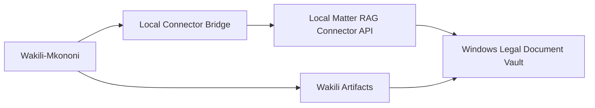

# Wakili-Mkononi Matter AI Integration

## Product Definition

Wakili-Mkononi Matter AI Integration connects Wakili-Mkononi to the Local Matter RAG Connector.

Wakili becomes the drafting, reasoning, and agentic workflow interface. The local DMS remains the system of record, and the local RAG connector remains the retrieval layer.

The product's promise:

"Use Wakili to draft and reason from your own matter documents without forcing your firm to upload its entire archive."

## Integration Principle

Wakili should consume matter-scoped context. It should not become the default document vault.

Default flow:

1. User selects matter in Wakili.
2. User links it to a local DMS matter.
3. Wakili asks local RAG connector for context.
4. Connector returns snippets and citations.
5. Wakili drafts, summarizes, compares, or asks follow-up questions.
6. User approves any generated output.
7. Approved output can be saved back to the DMS as a draft or artifact.

## Current Wakili-Mkononi Context

The deployed Wakili-Mkononi frontend appears to include:

- Authentication.
- Matters.
- File upload.
- Chat.
- Artifacts.
- Document panel flows.
- Review/accept/revise style interactions.
- Admin/profile/model configuration.

These observations should be verified against the private source code before implementation.

## Integration Architecture

## Local Connector Bridge

The bridge is the safest way to connect a cloud/web Wakili experience to a local Windows document vault.

Possible bridge modes:

- Localhost API called by a desktop companion.
- Wakili desktop shell embeds web UI and can call local services.
- Secure pairing token between Wakili web and local connector.
- Manual export/import for earliest proof of concept.

Final bridge design should be selected during implementation planning.

## Wakili Tools

### Search My Matter Documents

Input:

- Matter ID.
- Question or search query.
- Include/exclude drafts.
- Document filters.

Output:

- Snippets.
- Citations.
- Source status.
- Confidence.

### Summarize Matter Record

Generates:

- Parties.
- Pleadings summary.
- Orders/rulings.
- Key dates.
- Evidence list.
- Open issues.

### Extract Chronology

Generates a dated chronology from matter documents.

Each entry should cite source documents.

### Draft From Matter Facts

Drafts:

- Demand letter.
- Pleading section.
- Affidavit skeleton.
- Submissions outline.
- Client update.
- Case summary.

The tool should cite the matter facts used.

### Compare Draft to Filed Version

Compares:

- Latest draft vs filed copy.
- Amended pleading vs original pleading.
- Signed copy vs editable draft.

### Prepare Filing Pack

Wakili can request filing-pack preparation from Windows Legal Document Vault, but Windows Legal Document Vault owns the pack builder.

Wakili may:

- Suggest documents.
- Explain missing documents.
- Draft a checklist.

Windows Legal Document Vault should:

- Run readiness checks.
- Export pack.
- Track receipt.

## Data That Wakili Receives

By default, Wakili receives:

- Matter-scoped snippets.
- Source document metadata.
- Page references.
- Document status.
- User-approved generated drafts.

Wakili should not receive by default:

- Entire vault.
- All matters.
- Sensitive matters outside scope.
- Drafts when drafts are excluded.
- Raw documents unless user selects them.

## User Consent Points

Require explicit user action before:

- Linking a Wakili matter to a local DMS matter.
- Including drafts in RAG.
- Using cross-matter search.
- Uploading a full document to Wakili.
- Saving generated output back to DMS.
- Enabling any cloud-based retrieval.

## Generated Output Handling

Generated documents should enter the DMS as:

- Draft.
- Source: Wakili.
- Linked prompt/session ID where available.
- Linked cited source documents.
- Requires advocate review.

No generated output should be marked filed or served automatically.

## Security Requirements

- Matter pairing token.
- Short-lived connector sessions.
- Local permission check.
- Audit log for every Wakili retrieval.
- Clear UI indicator when Wakili is using local matter documents.
- Ability to revoke Wakili access.

## MVP Integration

The first integration can be simple:

- Export selected matter context from Windows Legal Document Vault.
- Index with Local Matter RAG Connector.
- Wakili calls local RAG endpoint.
- Wakili displays cited answer.
- User manually saves output back to DMS.

## Future Integration

Later versions may support:

- Deeper matter synchronization.
- Draft save-back.
- Filing-pack suggestions.
- Local desktop companion.
- Offline Wakili mode for local retrieval.
- Redaction before cloud model calls.

## Acceptance Criteria

Wakili-Mkononi Matter AI Integration is acceptable when:

- Wakili can query a single linked matter.
- Wakili receives citations.
- Drafts can be excluded.
- Sensitive matters require consent.
- Generated output is saved as draft, not filed.
- The local DMS remains the source of truth.

## Boundary Statement

Wakili is the legal AI workspace. Local Matter RAG Connector is the retrieval layer. Windows Legal Document Vault is the document vault. Each product must remain independently useful.
