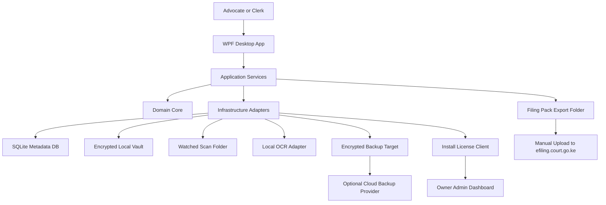

# Technical Architecture

## Architecture Summary

V1 uses a layered Windows desktop architecture.

## Chosen Stack

- Runtime: .NET 10 LTS.
- UI: WPF.
- Tests: xUnit.
- Metadata: SQLite.
- Search: SQLite FTS.
- Installer: Windows installer packaging after core workflows pass.

Reasoning:

- Strong native Windows fit.
- Good filesystem and background worker support.
- Straightforward testability.
- Mature SQLite and cryptography libraries.
- Lower runtime overhead than Electron for small office PCs.

## Project Structure

Planned code projects:

- `WakiliDms.App`: WPF UI, view models, navigation, app startup.
- `WakiliDms.Core`: domain entities, enums, validation rules, service contracts.
- `WakiliDms.Infrastructure`: SQLite repositories, vault storage, encryption, file watcher, OCR adapter, backup adapter.
- `WakiliDms.Tests`: unit and integration tests.

## Layer Responsibilities

### UI Layer

Owns:

- Screens.
- Forms.
- View models.
- User-facing validation messages.
- Navigation.

Does not own:

- Encryption.
- Persistence rules.
- Document lifecycle rules.
- Backup logic.

### Application Services

Own:

- Use cases.
- Workflow orchestration.
- Transaction boundaries.
- Audit event creation.
- Calling infrastructure adapters.

Examples:

- Create vault.
- Create matter.
- Import document.
- Change document status.
- Generate filing pack.
- Run backup.

### Domain Core

Owns:

- Entity definitions.
- Status enums.
- Invariants.
- Allowed lifecycle transitions.
- Shared result/error types.

### Infrastructure

Owns:

- SQLite access.
- Encrypted vault reads/writes.
- File hashing.
- File watcher.
- OCR adapter.
- Backup snapshot storage.
- Filesystem exports.

## Background Work

V1 background workers:

- File watcher for scanner folder.
- OCR queue worker.
- Backup worker.

Workers must:

- Avoid destructive changes without user confirmation.
- Record failures as diagnostic/audit events.
- Keep the app usable when a job fails.

## Future Integration Boundary

The Windows Legal Document Vault owns the matter record and document lifecycle.

Future systems may read from it:

- Local Matter RAG Connector reads metadata and OCR text.
- Wakili-Mkononi Matter AI Integration consumes retrieved matter context.

Neither future layer should own original documents or decide filing status.

## Optional Cloud Backup Boundary

Cloud backup is an optional add-on, not the system of record.

The Windows app should:

- Encrypt backup snapshots locally before upload.
- Upload only encrypted backup objects and backup manifests.
- Keep the local vault fully usable when cloud backup is disabled or offline.
- Let the user disconnect cloud backup without losing local data.

The cloud provider should never receive raw pleadings, drafts, evidence, court outputs, OCR text, or recovery keys.

## Owner Admin and Licensing Boundary

The owner admin dashboard is a control plane for monetization and support. It is not a document portal.

The Windows app may send:

- Installation ID.
- License key/account ID.
- Firm display name entered by the user.
- Device nickname.
- App version.
- Last check-in timestamp.
- Subscription/license status.
- Backup add-on enabled/disabled flag.
- Anonymous health flags such as "backup overdue" or "app outdated."

The Windows app must not send:

- Matter names.
- Party names.
- Client names.
- Case numbers.
- File names.
- OCR text.
- Document contents.
- Recovery keys.
- Filing-pack contents.

The admin dashboard can enable, disable, suspend, or revoke installation IDs, but disabling a license must not delete the local vault.
