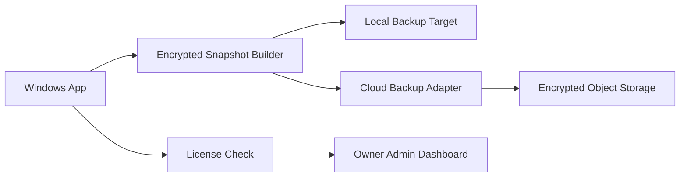

# Optional Cloud Backup

## Purpose

Cloud backup is a paid, plug-and-play recovery option for firms that want off-device protection. It must not change the local-first promise.

The Windows Legal Document Vault remains usable without cloud backup.

## Product Position

Cloud backup is:

- Optional.
- Paid/add-on controlled.
- Client-side encrypted.
- Recovery-focused.
- Separate from normal document storage.

Cloud backup is not:

- Primary storage.
- A document collaboration system.
- A way for the owner/admin to view client files.
- A source for model training.
- Required for local app use.

## User Flow

1. User opens Backup Center.
2. User sees local backup options first.
3. User selects `Enable cloud backup`.
4. App checks license entitlement.
5. App explains what will and will not leave the machine.
6. User confirms recovery key responsibility.
7. App creates encrypted snapshot.
8. App uploads encrypted snapshot.
9. App records backup status locally.
10. Admin dashboard receives install/license/backup-health metadata only.

## Architecture

## Provider Adapter Interface

The app should define a provider adapter so the first cloud provider can be swapped later.

Implemented V1 foundation:

- `ICloudBackupProvider.UploadSnapshotAsync(metadata, encryptedPackageBytes)`
- `ICloudBackupProvider.DownloadSnapshotAsync(installationId, snapshotId)`
- `ICloudBackupProvider.ListSnapshotsAsync(installationId)`
- `ICloudBackupProvider.DeleteSnapshotAsync(installationId, snapshotId)`
- `CloudBackupService.UploadSnapshotAsync(...)`
- `CloudBackupService.DownloadSnapshotAsync(...)`
- `LocalFilesystemCloudBackupProvider` for deterministic provider testing.
- Provider folders are rejected if they overlap the encrypted vault or local backup target. The provider path must be an independent storage location.

The first implemented adapter is not a production cloud vendor. It writes encrypted packages and redacted metadata to a local folder shaped like object storage. This lets the product validate entitlement, encryption, metadata safety, download, and restore behavior before adding S3-compatible storage, Azure Blob, Google Cloud Storage, or a managed Wakili storage endpoint.

Future provider operations:

- `CheckEntitlement(installationId, licenseKey)` against hosted admin/payment backend.
- `ReportBackupHealth(installationId, status)` to the admin dashboard.
- Retry/queue upload when the machine is offline.

## Snapshot Contents

Encrypted snapshot includes:

- Vault object files.
- SQLite metadata backup.
- Snapshot manifest.
- Integrity hashes.
- App/schema version.

Important implementation detail:

- The local backup directory can contain local vault metadata such as encrypted object JSON.
- Before cloud upload, the entire local backup directory is zipped and encrypted with the user's recovery key.
- The cloud provider receives only the encrypted package bytes and allowed cloud metadata.

Snapshot does not include:

- Plain recovery key.
- Raw unencrypted documents.
- Plain OCR text outside encrypted vault.
- Admin-readable matter metadata.

## Cloud Metadata

Allowed metadata:

- Installation ID.
- Snapshot ID.
- Snapshot byte size.
- Snapshot hash.
- Created timestamp.
- Upload status.

License ID and backup-health reporting are intentionally deferred to the hosted admin/payment backend. The current adapter foundation does not send license keys to provider storage.

Forbidden metadata:

- Client names.
- Matter names.
- Party names.
- Court case numbers.
- Document filenames.
- OCR text.
- Filing-pack document list.

## Restore Flow on New Machine

1. Install app.
2. Enter license key or installation recovery code.
3. Select cloud backup restore.
4. App lists snapshots for that installation.
5. App downloads encrypted snapshot package.
6. User enters recovery key.
7. App decrypts and extracts locally.
8. App runs the restore drill against the extracted snapshot.
9. App restores to a new local vault path only after checksum verification.

## Failure Modes

### Offline

- Local app remains usable.
- Cloud backup queues or reports paused.

### License Disabled

- New uploads stop.
- Local vault remains accessible.
- User can still export local matter data.

### Lost Recovery Key

- Cloud snapshot cannot be decrypted.
- Admin cannot recover raw documents.

### Upload Interrupted

- Snapshot remains incomplete.
- App retries or marks failed.
- Failed snapshot must not replace last known good snapshot.

## Acceptance Criteria

Cloud backup is acceptable when:

- Disabled by default.
- Requires entitlement.
- Uploads only encrypted snapshots.
- Admin dashboard cannot read documents.
- Restore works on a second Windows machine with recovery key.
- Disabling license stops future cloud backup without deleting local data.

## Current Implementation Status

Complete in this slice:

- Provider-neutral cloud backup interface.
- Recovery-key encrypted cloud package creation.
- Provider-safe metadata model.
- Local filesystem provider for repeatable testing.
- Download/decrypt/extract flow.
- Restore drill compatibility after cloud download.
- Tests proving entitlement is required.
- Tests proving cloud metadata and package bytes do not expose matter names, party names, document filenames, or document text.
- Backup Center controls in the Windows app for local-provider testing:
  - Enable cloud backup after setup.
  - Upload encrypted cloud backup.
  - Refresh cloud backup snapshots.
  - Download selected snapshot and run restore drill.

Still pending:

- Hosted admin/payment entitlement check.
- Real cloud/vendor provider.
- Upload retry queue.
- Cross-machine restore wizard.

Hosted admin/payment entitlement integration was intentionally skipped after the adapter foundation. Current user-facing controls rely on local app settings and the local filesystem provider so backup behavior can be tested end to end without payment infrastructure.

## Local Provider Backup Center Flow

The current Windows app flow is:

1. Complete first-run setup.
2. Enter a local provider folder under `Cloud backup`.
3. Click `Enable cloud backup`.
4. Enter the recovery key in the Backup Center recovery key field.
5. Click `Upload encrypted cloud backup`.
6. Click `Refresh cloud backups`.
7. Select a cloud snapshot.
8. Enter a cloud restore target folder.
9. Enter the recovery key again.
10. Click `Run selected cloud restore drill`.

Expected result:

- A normal local backup snapshot is created first.
- A recovery-key encrypted cloud package is written to the local provider folder.
- The provider metadata contains only installation/snapshot metadata.
- The selected snapshot downloads into the restore target.
- Restore drill verifies checksums and decryptability.
