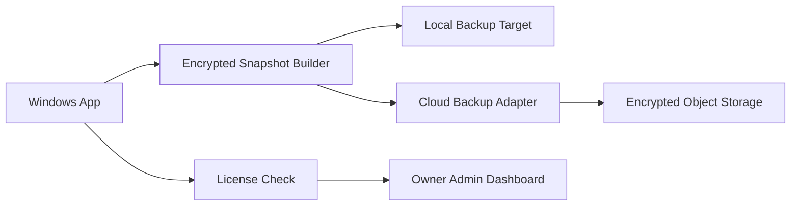

# Optional Cloud Backup

## Purpose

Cloud backup is a paid, plug-and-play recovery option for firms that want off-device protection. It must not change the local-first promise.

The Windows Legal Document Vault remains usable without cloud backup.

## Product Position

Cloud backup is:

- Optional.
- Paid/add-on controlled.
- Client-side encrypted.
- Recovery-focused.
- Separate from normal document storage.

Cloud backup is not:

- Primary storage.
- A document collaboration system.
- A way for the owner/admin to view client files.
- A source for model training.
- Required for local app use.

## User Flow

1. User opens Backup Center.
2. User sees local backup options first.
3. User selects `Enable cloud backup`.
4. App checks license entitlement.
5. App explains what will and will not leave the machine.
6. User confirms recovery key responsibility.
7. App creates encrypted snapshot.
8. App uploads encrypted snapshot.
9. App records backup status locally.
10. Admin dashboard receives install/license/backup-health metadata only.

## Architecture

## Provider Adapter Interface

The app should define a provider adapter so the first cloud provider can be swapped later.

Conceptual operations:

- `CheckEntitlement(installationId, licenseKey)`
- `UploadSnapshot(snapshotId, encryptedBytes, manifest)`
- `ListSnapshots(installationId)`
- `DownloadSnapshot(snapshotId)`
- `DeleteSnapshot(snapshotId)`
- `ReportBackupHealth(installationId, status)`

## Snapshot Contents

Encrypted snapshot includes:

- Vault object files.
- SQLite metadata backup.
- Snapshot manifest.
- Integrity hashes.
- App/schema version.

Snapshot does not include:

- Plain recovery key.
- Raw unencrypted documents.
- Plain OCR text outside encrypted vault.
- Admin-readable matter metadata.

## Cloud Metadata

Allowed metadata:

- Installation ID.
- License ID.
- Snapshot ID.
- Snapshot byte size.
- Snapshot hash.
- Created timestamp.
- Upload status.
- Restore-tested timestamp if user runs restore drill.

Forbidden metadata:

- Client names.
- Matter names.
- Party names.
- Court case numbers.
- Document filenames.
- OCR text.
- Filing-pack document list.

## Restore Flow on New Machine

1. Install app.
2. Enter license key or installation recovery code.
3. Select cloud backup restore.
4. App downloads encrypted snapshot.
5. User enters recovery key.
6. App decrypts locally.
7. App restores to a new local vault path.
8. App verifies checksums.

## Failure Modes

### Offline

- Local app remains usable.
- Cloud backup queues or reports paused.

### License Disabled

- New uploads stop.
- Local vault remains accessible.
- User can still export local matter data.

### Lost Recovery Key

- Cloud snapshot cannot be decrypted.
- Admin cannot recover raw documents.

### Upload Interrupted

- Snapshot remains incomplete.
- App retries or marks failed.
- Failed snapshot must not replace last known good snapshot.

## Acceptance Criteria

Cloud backup is acceptable when:

- Disabled by default.
- Requires entitlement.
- Uploads only encrypted snapshots.
- Admin dashboard cannot read documents.
- Restore works on a second Windows machine with recovery key.
- Disabling license stops future cloud backup without deleting local data.

